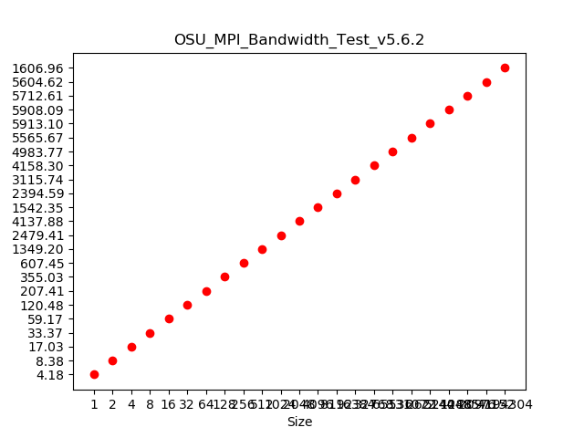
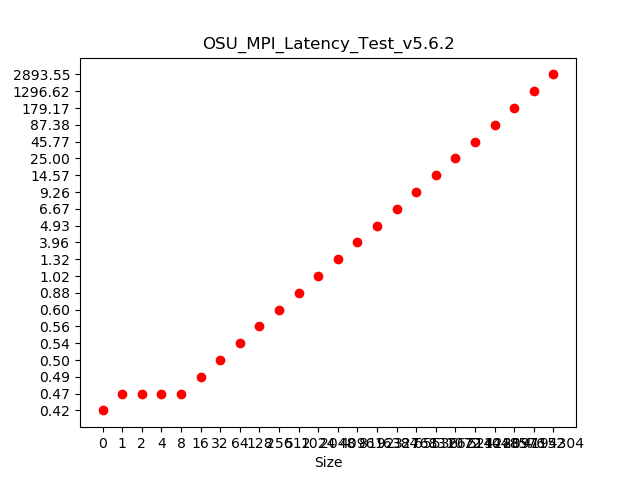
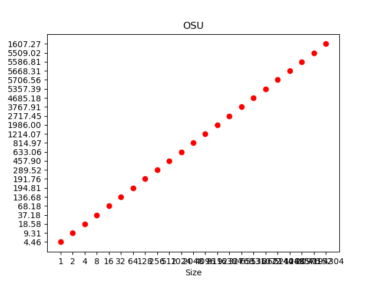
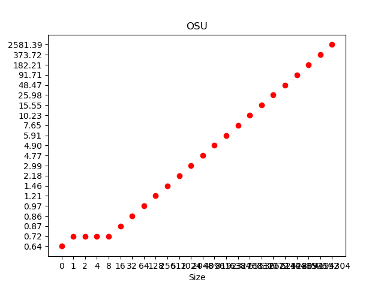
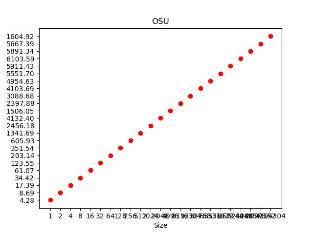
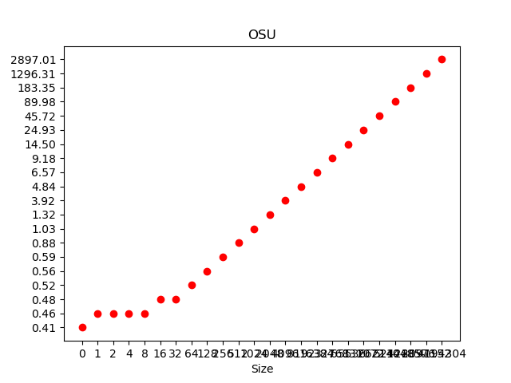
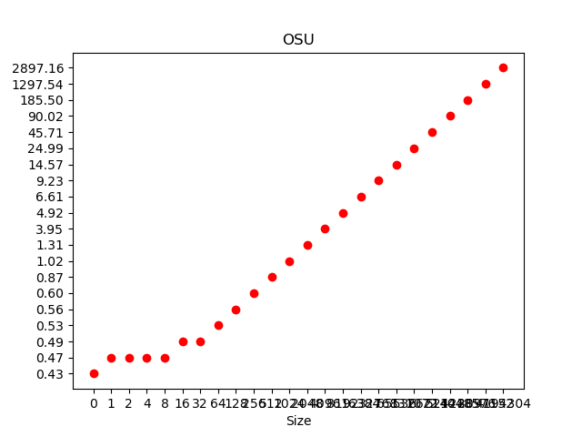

# Exercise 2

Group members: **Patrick Lanzinger, Raphael Gruber**

## Download and build the OSU Micro-Benchmarks 

## After building, submit SGE jobs that run the `osu_latency` and `osu_bw` executables.

## Create a table and figures that illustrate the measured data and study them. What effects can you observe?

 
 

The bandwith is linear and the latency states same until 8 size then growth linear as well

## Modify your experiment such that the 2 MPI ranks are placed on

### different cores of the same socket

Bandwith
 
Lantency
 

### different sockets of the same node

 
 

### different nodes

 
 

## Ammend your table and figures to include these additional measurements. What effects can you observe? How can you verify rank placement without looking at performance?

### different cores of the same socket

 
 

 
 

 
 

### different sockets of the same node

 
 

 
 

 
 

### different nodes

 
 

 
 

 
 

## How stable are the measurements when running the experiments multiple times?
