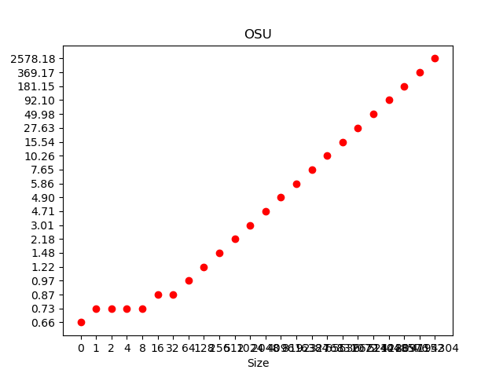
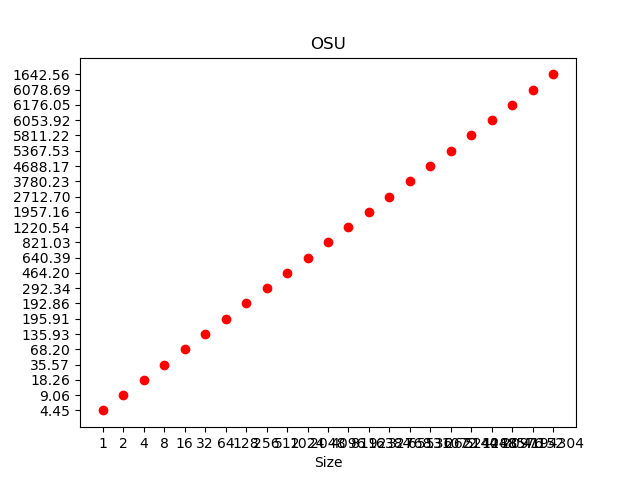
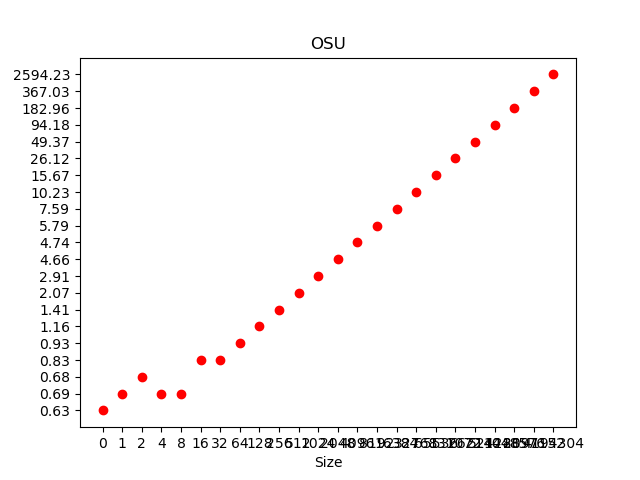
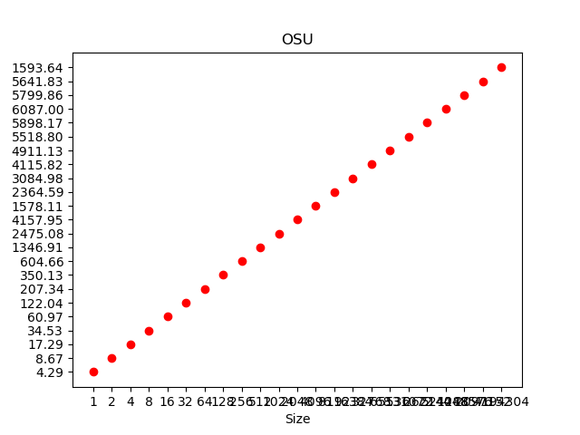
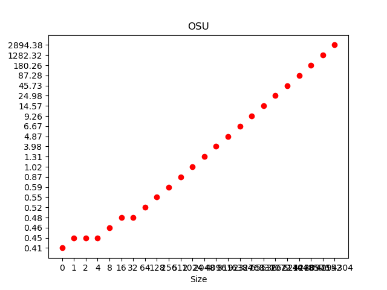

# Exercise 2

Group members: **Patrick Lanzinger, Raphael Gruber**

## Download and build the OSU Micro-Benchmarks 

## After building, submit SGE jobs that run the `osu_latency` and `osu_bw` executables.

## Create a table and figures that illustrate the measured data and study them. What effects can you observe?

Bandwith

 

Lantency

 

The bandwith is linear and the latency states same until 8 size then growth linear as well

## Modify your experiment such that the 2 MPI ranks are placed on

### different cores of the same socket

Bandwith

 

Lantency

 

### different sockets of the same node

Bandwith

 

Lantency

 

### different nodes

Bandwith

 

Lantency

 

## Ammend your table and figures to include these additional measurements. What effects can you observe? How can you verify rank placement without looking at performance?

The latency is less in by using different sockets of the same node compare to the other two. The bandwith is higher by using different cores of the same socket. In general all growth lineraly.

## How stable are the measurements when running the experiments multiple times?

### different cores of the same socket

Bandwith 1

 

Latency 1

 

Bandwith 2

 

Latency 2

 

Bandwith 3

 

Latency 3

 

### different sockets of the same node

Bandwith 1

 

Lantency 1

 

Bandwith 2

 

Lantency 2

 

Bandwith 3

 

Lantency 3

 

### different nodes

Bandwith 1

 

Lantency 1

 

Bandwith 2

 

Lantency 2

 

Bandwith 3

 

Lantency 3

 

We get similar results. The latency sometimes varies slightly in low sizes, but after that it always grows linearly
