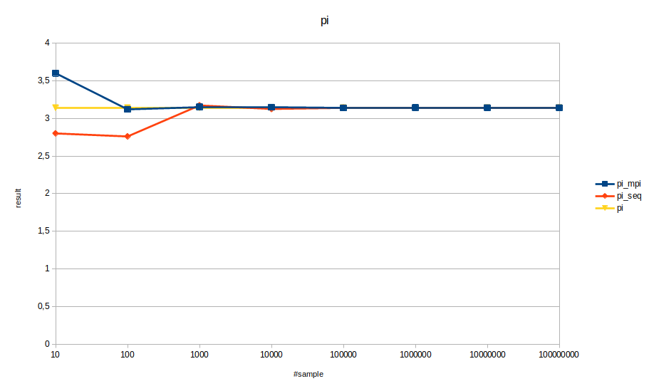
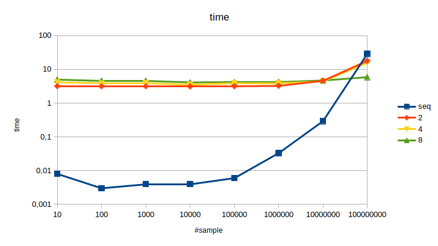

# Exercise 1

## Write a sequential application `pi_seq` in C or C++ that computes π for a given number of samples (command line argument). Test your application for various, large sample sizes to verify the correctness of your implementation.

Execute make file and ```pi_seq```.

Results are close to the value of π.

## Consider a palatalization strategy using MPI. Which communication pattern(s) would you choose and why?

Since we create random values, we only have to parallelize this part. We don't have to send any initialize data to other ranks. For gathering results, we used  ```MPI_Reduce``` with the ```MPI_SUM``` method.

## Implement your chosen parallelization strategy as a second application `pi_mpi`. Run it with varying numbers of ranks and sample sizes and verify its correctness by comparing the output to `pi_seq`.

 

## Discuss the effects and implications of your parallelization.

With low number of sample we can't see any difference in the speed up.
Whereas higher number significantly gets faster parallelized and with more ranks.

 
