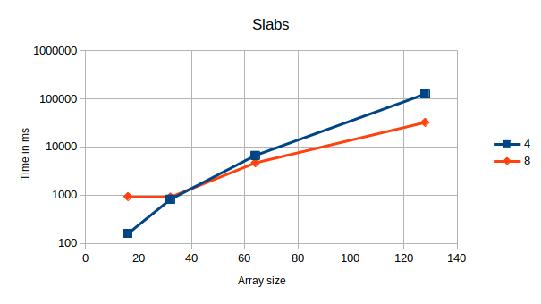
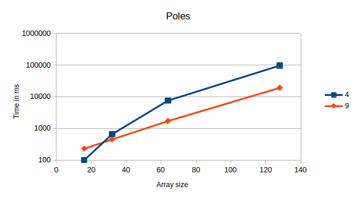
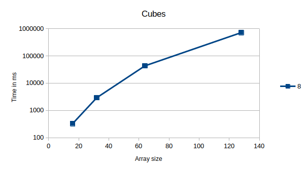
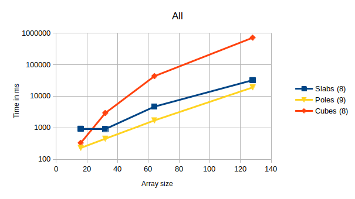

# Assignment 4, due November 6th 2019

The goal of this assignment is to extend the 3D heat stencil application of Assignment 3 to include multiple domain decomposition schemes and investigate the effect of non-blocking communication.

Group members: Raphael Gruber, Patrick Lanzinger, Geni Bushati

## Exercise 1

### Tasks

#### Provide implementations for the 3D heat stencil application that rely on the three domain decomposition variants presented in the lecture.

see ``heat_stencil_3D_slabs.c``, ``heat_stencil_3D_poles.c`` and ``heat_stencil_3D_cubes.c``.
Unfortunately the poles version is not working correctly.

#### Measure their speedup and efficiency for multiple problem and machine sizes as in the previous exercise.
#### Illustrate the data in appropriate figures and discuss them. What can you observe?

 

 

 

 

We can observe that cubes is much slower and poles and slabs have a similar time.

- Speedup for heat_stencil_3D_cubes ranks:8 and heat_stencil_3D_poles ranks:9 and  number of arrays:16 is 1.434

- Speedup for heat_stencil_3D_cubes ranks:8 and heat_stencil_3D_poles ranks:9 and  number of arrays:32 is 6.511

- Speedup for heat_stencil_3D_cubes ranks:8 and heat_stencil_3D_poles ranks:9 and  number of arrays:64 is 25.298

- Speedup for heat_stencil_3D_cubes ranks:8 and heat_stencil_3D_poles ranks:9 and  number of arrays:128 is 37.490

- Speedup for heat_stencil_3D_poles ranks:4 and heat_stencil_3D_slabs ranks:4 and  number of arrays:16 is 0.625

- Speedup for heat_stencil_3D_poles ranks:4 and heat_stencil_3D_slabs ranks:4 and  number of arrays:32 is 0.804

- Speedup for heat_stencil_3D_poles ranks:4 and heat_stencil_3D_slabs ranks:4 and  number of arrays:64 is 1.128

- Speedup for heat_stencil_3D_poles ranks:4 and heat_stencil_3D_slabs ranks:4 and  number of arrays:128 is 0.760

- Speedup for heat_stencil_3D_cubes ranks:8 and heat_stencil_3D_slabs ranks:8 and  number of arrays:16 is 0.354

- Speedup for heat_stencil_3D_cubes ranks:8 and heat_stencil_3D_slabs ranks:8 and  number of arrays:32 is 3.219

- Speedup for heat_stencil_3D_cubes ranks:8 and heat_stencil_3D_slabs ranks:8 and  number of arrays:64 is 9.243

- Speedup for heat_stencil_3D_cubes ranks:8 and heat_stencil_3D_slabs ranks:8 and  number of arrays:128 is 22.132
