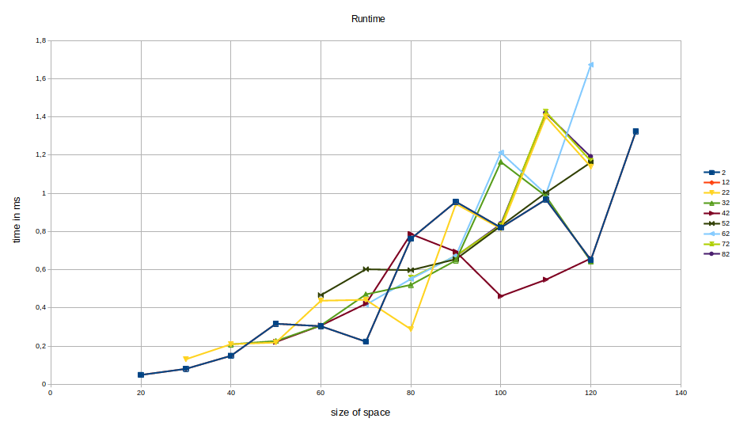

# Exercise 1

# Exercise 2

We want to optimize the method ``calcNewSpace``. Since here we loop twice over the whole space.

For this, rank 0 initialize the space and sends it to all other ranks.
Then we divide our particles equally over all ranks and calculate of each particle the new coordinates.
In the end every rank sends its calculated particles to rank 0.
Rank 0 should solve all collision before merging all space together in one new space.
