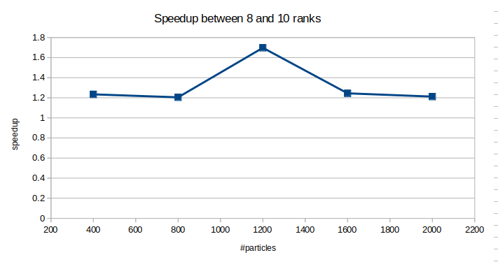
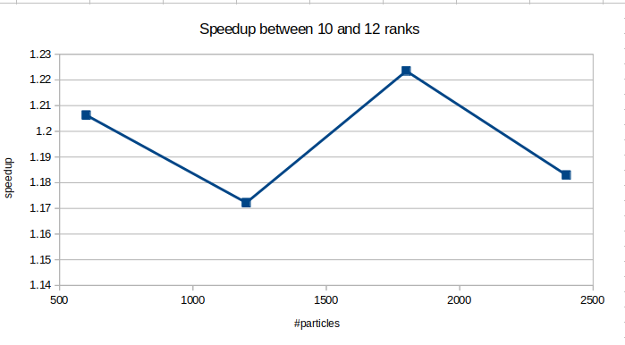
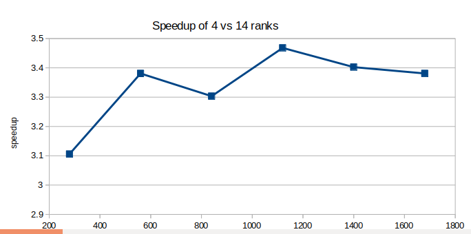

# Assignment 6, due November 20th 2019

The goal of this assignment is to implement your parallelization and optimization plan of the n-body simulation of Assignment 5.

## Exercise 1

We can observe that by increasing the problem size, the calculation time goes exponential up.
Futhermore, we see that the time decreases by incresing the rank size

